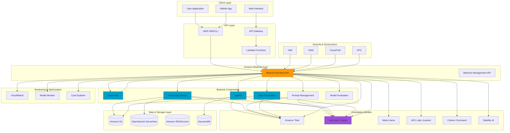
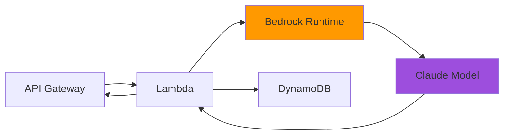
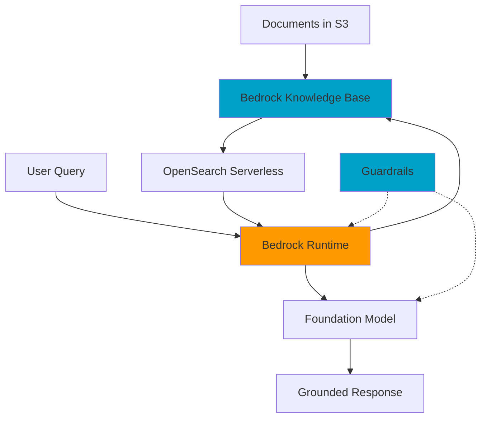
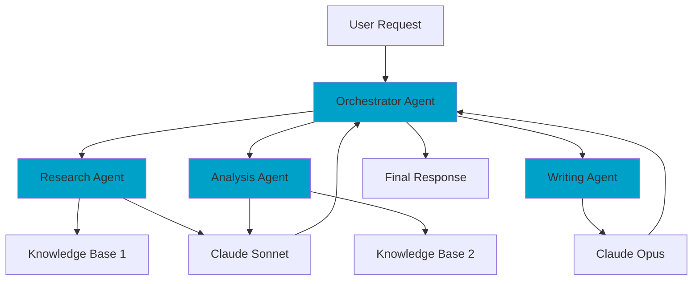
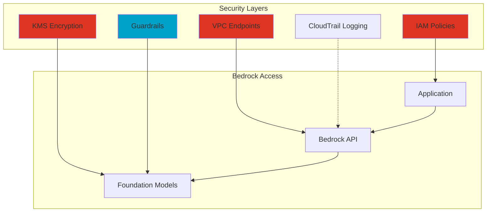

## 📐 Amazon Bedrock Architecture Diagrams

Visual reference guide for understanding Amazon Bedrock's architecture and components for the AWS Certified Generative AI Developer – Professional exam.

---

## 🏗️ Overall Bedrock Architecture

This diagram shows the complete Amazon Bedrock ecosystem and how all components work together.



---

## 📊 Architecture Components Breakdown

### 1️⃣ Client Layer
**What it represents:**
- User-facing applications that consume Bedrock services
- Can be web apps, mobile apps, enterprise systems, or custom applications

**Key Points:**
- Multiple client types can access Bedrock simultaneously
- Authentication handled through AWS credentials

---

### 2️⃣ API Layer
**What it represents:**
- Interface between client applications and Bedrock services
- Provides flexibility for different integration patterns

**Components:**
- **AWS SDK/CLI:** Direct programmatic access to Bedrock APIs
- **API Gateway:** RESTful API endpoints for web/mobile clients
- **Lambda Functions:** Serverless orchestration layer

---

### 3️⃣ Amazon Bedrock Core
**What it represents:**
- Central service that orchestrates all Bedrock functionality

**APIs:**
- **Runtime API:** For invoking models, agents, and generating responses
- **Management API:** For configuring components, managing resources

---

### 4️⃣ Bedrock Components
**What they represent:**
- Managed capabilities that enhance foundation model usage

**Components:**
- **Guardrails:** Safety and content filtering
- **Agents:** Autonomous task execution with reasoning
- **Knowledge Bases:** RAG implementation with vector search
- **Prompt Management:** Versioned prompt templates
- **Data Automation:** Multimodal content processing
- **Model Evaluation:** Quality assessment and benchmarking

---

### 5️⃣ Foundation Models
**What they represent:**
- Pre-trained large language models from various providers

**Available Models:**
- **Amazon Titan:** AWS-native models for text, embeddings, multimodal
- **Anthropic Claude:** Advanced reasoning and coding (Claude Opus 4, Sonnet 4.5)
- **Meta Llama:** Open-source models (Llama 3.x)
- **AI21 Labs Jurassic:** Multilingual text generation
- **Cohere Command:** Enterprise-focused models
- **Stability AI:** Image generation (Stable Diffusion)

---

### 6️⃣ Data & Storage Layer
**What it represents:**
- Persistent storage for various data types used by Bedrock

**Services:**
- **S3:** Document storage for Knowledge Bases, Data Automation inputs
- **OpenSearch Serverless:** Vector database for embeddings and semantic search
- **RDS/Aurora:** Structured metadata and application data
- **DynamoDB:** Session state, conversation history, low-latency lookups

---

### 7️⃣ Security & Governance
**What it represents:**
- AWS security services integrated with Bedrock

**Components:**
- **IAM:** Fine-grained access control to models and features
- **KMS:** Encryption keys for data at rest
- **CloudTrail:** Audit logging of all API calls
- **VPC:** Network isolation for private access

---

### 8️⃣ Monitoring & Optimization
**What it represents:**
- Observability and cost management for Bedrock workloads

**Tools:**
- **CloudWatch:** Metrics, logs, alarms for model invocations
- **Model Monitor:** Track model performance and quality
- **Cost Explorer:** Analyze token usage and spending patterns

---

## 🔄 Key Data Flows

### Flow 1: Simple Model Invocation
```
User App → SDK → Bedrock Runtime API → Foundation Model → Response
```

### Flow 2: Invocation with Guardrails
```
User App → SDK → Bedrock Runtime → Guardrails (Input Filter) → 
Foundation Model → Guardrails (Output Filter) → Response
```

### Flow 3: RAG with Knowledge Base
```
User Query → Bedrock → Knowledge Base → Vector Search (OpenSearch) → 
Retrieved Context → Foundation Model → Grounded Response
```

### Flow 4: Agent Workflow
```
User Request → Agent → Planning → Tool Calls → Knowledge Base → 
Action APIs → Foundation Model → Final Response
```

### Flow 5: Data Automation Processing
```
Multimodal Input (S3) → Data Automation → Foundation Model → 
Structured Output → Storage (S3/Database)
```

---

## 🎯 Exam Focus Areas

### Architecture Decision Points

**When to use which component:**

| Scenario | Component to Use | Why |
|----------|-----------------|-----|
| Need to ground responses in company documents | Knowledge Bases | Managed RAG with vector search |
| Must filter harmful content | Guardrails | Built-in content moderation |
| Multi-step reasoning with external APIs | Agents | Autonomous orchestration |
| Process unstructured documents at scale | Data Automation | Multimodal extraction |
| Version and manage prompts centrally | Prompt Management | Governance and consistency |
| Need to evaluate model quality | Model Evaluation | Automated testing and metrics |

---

## 📚 Integration Patterns

### Pattern 1: Serverless GenAI Application


### Pattern 2: Enterprise RAG System


### Pattern 3: Multi-Agent Collaboration


---

## 🔐 Security Architecture



**Security Best Practices:**
1. ✅ Use IAM roles with least privilege
2. ✅ Enable VPC endpoints for private connectivity
3. ✅ Encrypt data with customer-managed KMS keys
4. ✅ Apply Guardrails for content safety
5. ✅ Enable CloudTrail for audit compliance
6. ✅ Use resource-based policies for cross-account access

---

## 💡 Key Takeaways for Exam

### Remember These Patterns:

1. **Bedrock Runtime API** = Model invocations, agent calls, knowledge base queries
2. **Bedrock Management API** = Configuration, resource management
3. **Guardrails** = Always applied BEFORE and AFTER model invocation
4. **Knowledge Bases** = Managed RAG with automatic chunking and embedding
5. **Agents** = Autonomous workflows with planning and tool execution
6. **Data Automation** = Multimodal content → structured output

### Common Tradeoffs:

| Consideration | Managed Bedrock Components | Custom Build |
|---------------|---------------------------|--------------|
| Time to Market | ⚡ Fast | 🐌 Slow |
| Customization | 🎯 Limited | 🔧 Full control |
| Maintenance | ✅ AWS-managed | 🛠️ You maintain |
| Cost | 💰 Pay-per-use | 💸 Infrastructure + Dev time |
| Scalability | 📈 Automatic | 📊 Manual tuning |

---

## 📚 References

- [Amazon Bedrock User Guide](https://docs.aws.amazon.com/bedrock/)
- [Amazon Bedrock Runtime API Reference](https://docs.aws.amazon.com/bedrock/latest/APIReference/welcome.html)
- [AWS Architecture Blog: Bedrock](https://aws.amazon.com/blogs/architecture/tag/amazon-bedrock/)
- [Amazon Bedrock Agents](https://docs.aws.amazon.com/bedrock/latest/userguide/agents.html)
- [Amazon Bedrock Knowledge Bases](https://docs.aws.amazon.com/bedrock/latest/userguide/knowledge-base.html)
- [Amazon Bedrock Guardrails](https://docs.aws.amazon.com/bedrock/latest/userguide/guardrails.html)

---

**💡 Tip:** Study these diagrams alongside scenario-based questions. The exam will ask "What's the BEST architecture for X scenario?" - knowing these patterns helps you eliminate wrong answers quickly.
