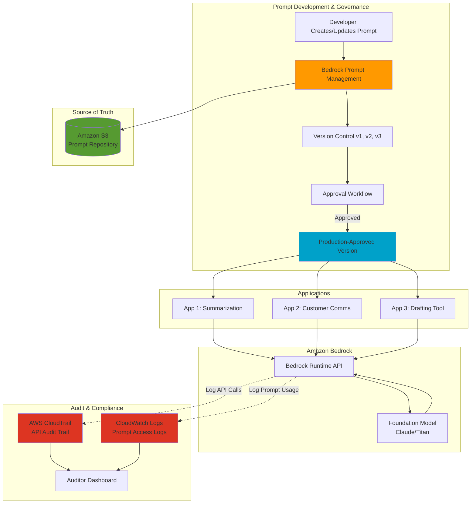
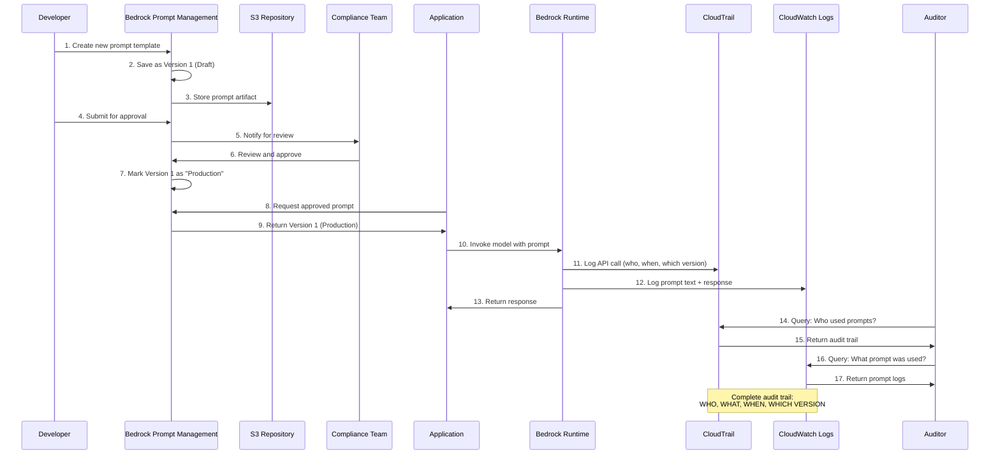
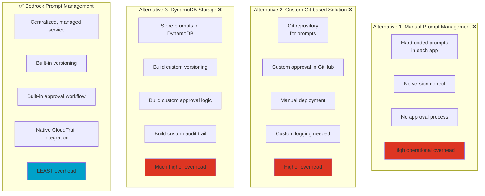
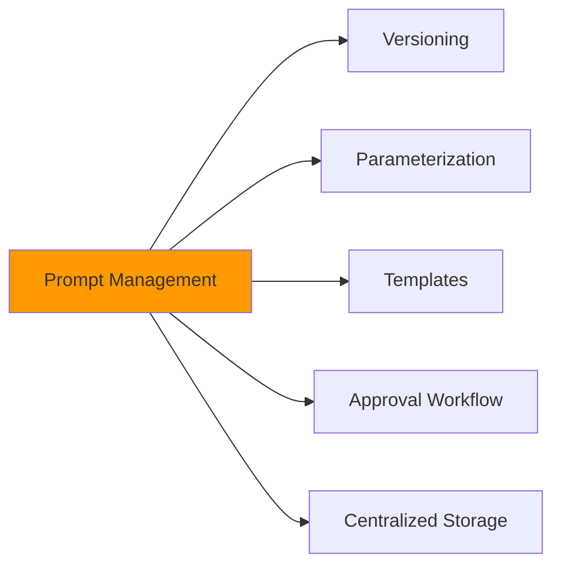
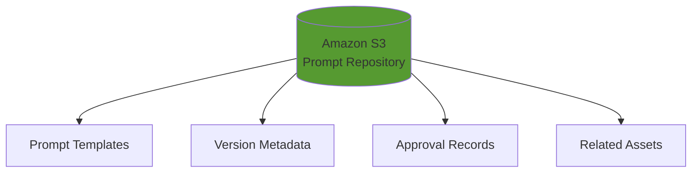
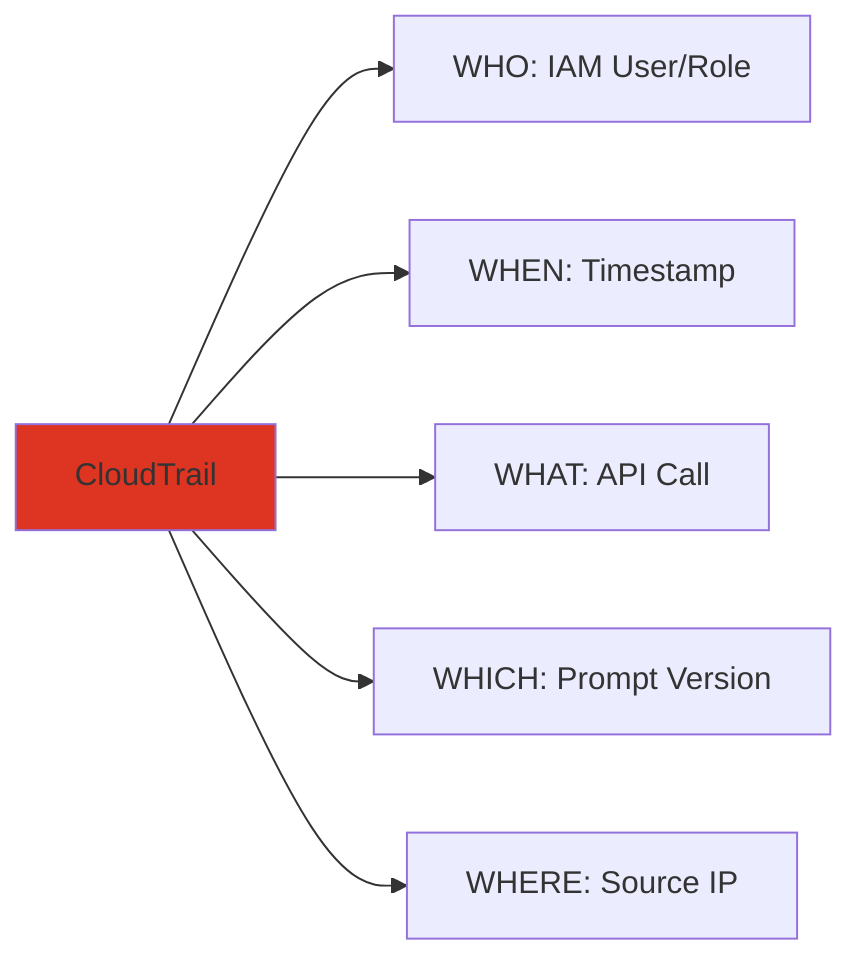
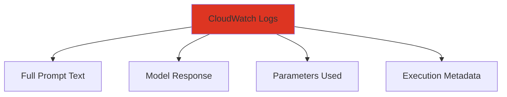
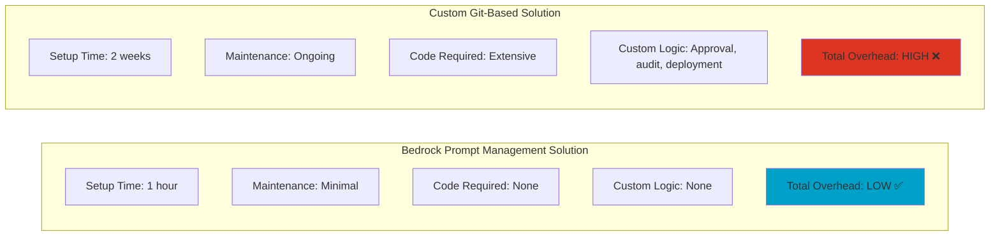
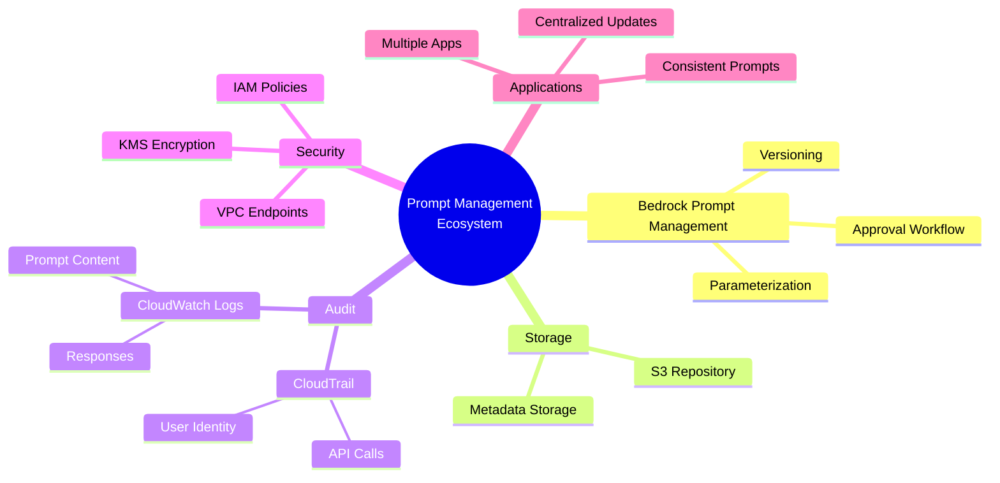

## 📝 Practice Question Visual Diagrams

Visual explanations of practice exam questions to reinforce learning through diagrams.

---

## Question 1: Centralized Prompt Management with Governance

### 📋 The Question

A platform team at a regulated financial institution is building multiple internal applications that invoke Amazon Bedrock FMs for tasks such as summarization and drafting customer communications. The team must ensure that all applications use consistent, centrally managed prompts. Prompt changes must be reviewed and approved before they can be used in production, and auditors must be able to determine who used which prompt version and when. 

**Which solution will meet these requirements with the LEAST operational overhead?**

---

### ✅ The Answer

**Use Amazon Bedrock Prompt Management to create reusable, parameterized prompts with versioning and an approval workflow. Store the prompt template repository in Amazon S3 as the source of truth. Enable AWS CloudTrail to audit Bedrock API usage and send application prompt/response access logs to Amazon CloudWatch Logs.**

---

### 💡 Explanation

Bedrock Prompt Management provides centralized prompt storage, parameterization (template variables), and version governance, including controlled promotion of prompt versions through an approval process. S3 provides a durable repository for prompt artifacts and related assets. CloudTrail gives an audit trail for API activity (who/when invoked Bedrock operations), while CloudWatch Logs provides centralized operational logging of prompt access and usage across applications for investigations and oversight.

---

## 📊 Visual Explanation

Below are detailed diagrams that break down why this is the correct answer and how the solution works.

---

### ✅ Correct Answer Architecture



---

### 🔄 Prompt Lifecycle Workflow



---

### 🎯 Why This Solution is BEST

#### ✅ Meets All Requirements

| Requirement | How It's Met | Component |
|-------------|--------------|-----------|
| **Centrally managed prompts** | Single source of truth for all apps | Bedrock Prompt Management |
| **Consistent across apps** | All apps reference same prompt versions | Parameterized templates |
| **Review & Approval** | Built-in approval workflow | Prompt Management versioning |
| **Audit who/when/which version** | Complete API and usage logging | CloudTrail + CloudWatch Logs |
| **LEAST operational overhead** | Fully managed services, no custom code | All AWS-managed services |

---

### ❌ Why Other Approaches Don't Work



---

### 🔍 Detailed Component Breakdown

#### 1️⃣ Amazon Bedrock Prompt Management

**What it provides:**


**Key Features:**
- ✅ **Versioning:** Automatically tracks v1, v2, v3, etc.
- ✅ **Parameterization:** Variables like `{{customer_name}}`, `{{topic}}`
- ✅ **Approval States:** Draft → Review → Production
- ✅ **Reusability:** Same prompt used across multiple apps
- ✅ **Rollback:** Can revert to previous versions

**Example:**
```
Prompt Template:
"Summarize the following customer communication about {{topic}} 
for {{customer_name}}. Focus on {{focus_area}}."

Version 1 (Production) - Approved by Compliance Team
Version 2 (Draft) - Under review
```

---

#### 2️⃣ Amazon S3 as Source of Truth

**What it stores:**


**Why S3:**
- ✅ Durable storage (99.999999999% durability)
- ✅ Versioning enabled
- ✅ Lifecycle policies for compliance
- ✅ Access logging
- ✅ Backup and restore

---

#### 3️⃣ AWS CloudTrail - API Audit Trail

**What it logs:**


**Example CloudTrail Log:**
```json
{
  "eventName": "InvokeModel",
  "userIdentity": {
    "arn": "arn:aws:iam::123456789012:user/alice"
  },
  "eventTime": "2026-01-22T10:30:00Z",
  "requestParameters": {
    "promptId": "prompt-abc123",
    "promptVersion": "v3"
  },
  "sourceIPAddress": "10.0.1.50"
}
```

**Answers Auditor Questions:**
- ❓ Who invoked the prompt? → `alice`
- ❓ When? → `2026-01-22T10:30:00Z`
- ❓ Which version? → `v3`

---

#### 4️⃣ CloudWatch Logs - Prompt Content Logging

**What it logs:**


**Example CloudWatch Log:**
```json
{
  "timestamp": "2026-01-22T10:30:00Z",
  "promptVersion": "v3",
  "promptText": "Summarize the following customer communication...",
  "parameters": {
    "customer_name": "Acme Corp",
    "topic": "Q4 Financial Review"
  },
  "modelResponse": "Summary: Acme Corp's Q4 financial...",
  "userId": "alice"
}
```

**Enables Investigation:**
- ❓ What exact prompt was used? → Full text available
- ❓ What was the output? → Response logged
- ❓ What parameters were passed? → All params logged

---

### 📊 Complete Audit Trail Visualization

```mermaid
graph TB
    subgraph "Audit Question: Who used Prompt v3 on Jan 22?"
        Q[Auditor Query]
    end
    
    subgraph "CloudTrail Provides"
        CT1[User: alice]
        CT2[Time: 2026-01-22 10:30]
        CT3[Prompt: v3]
        CT4[Source IP: 10.0.1.50]
    end
    
    subgraph "CloudWatch Logs Provides"
        CW1[Full prompt text]
        CW2[Parameters used]
        CW3[Model response]
        CW4[Application context]
    end
    
    subgraph "S3 Repository Provides"
        S3A[Prompt template history]
        S3B[Approval records]
        S3C[Who approved v3]
        S3D[When v3 was promoted]
    end
    
    Q --> CT1
    Q --> CW1
    Q --> S3A
    
    style Q fill:#FFD700
    style CT1 fill:#DD3522
    style CT2 fill:#DD3522
    style CT3 fill:#DD3522
    style CT4 fill:#DD3522
    style CW1 fill:#DD3522
    style CW2 fill:#DD3522
    style CW3 fill:#DD3522
    style CW4 fill:#DD3522
    style S3A fill:#569A31
    style S3B fill:#569A31
    style S3C fill:#569A31
    style S3D fill:#569A31
```



---

### 🎓 Key Exam Takeaways

#### Pattern Recognition for Similar Questions

**Keywords that trigger this solution:**
- ✅ "Centrally managed prompts"
- ✅ "Approval workflow" / "Review before production"
- ✅ "Audit trail" / "Who used what when"
- ✅ "LEAST operational overhead"
- ✅ "Regulated" / "Financial institution" / "Compliance"
- ✅ "Multiple applications" + "consistent prompts"

#### When to Choose Bedrock Prompt Management

| Scenario | Use Prompt Management? |
|----------|----------------------|
| Multiple apps need same prompts | ✅ YES |
| Need approval workflow | ✅ YES |
| Need version control | ✅ YES |
| Need audit trail | ✅ YES |
| Want LEAST overhead | ✅ YES |
| Need custom prompt logic | ❌ NO - Build custom |
| Simple single-app use | ⚠️ MAYBE - Could be overkill |

---

### 🔄 Comparison: Overhead Analysis



---

### 💡 Remember This Pattern

**The "Managed Service First" Principle:**

When exam asks for "LEAST operational overhead":
1. ✅ **First choice:** Fully managed AWS service (Bedrock Prompt Management)
2. ❌ **Avoid:** Custom-built solutions (DynamoDB + Lambda)
3. ❌ **Avoid:** Third-party tools requiring integration
4. ❌ **Avoid:** Manual processes

**This question tests:**
- Knowledge of Bedrock Prompt Management features
- Understanding of audit/compliance requirements
- Ability to choose managed services over custom builds
- Integration of CloudTrail + CloudWatch for compliance

---

### 📚 Related AWS Services



---

### 🎯 Practice: Similar Question Variations

You might see variations like:

**Variation 1:** "How to ensure different teams can't use unapproved prompts?"
- **Answer:** IAM policies + Prompt Management approval states

**Variation 2:** "How to track which customer data was used in prompts?"
- **Answer:** CloudWatch Logs with prompt parameter logging

**Variation 3:** "How to rollback to a previous prompt version quickly?"
- **Answer:** Bedrock Prompt Management version control

**Variation 4:** "How to update prompts without redeploying applications?"
- **Answer:** Centralized Prompt Management (apps reference by ID, not hard-code)

---

## 📝 Summary Checklist

For this type of question, the solution must have:

- ✅ **Centralization:** One source of truth (Prompt Management)
- ✅ **Version Control:** Track all changes (Built-in versioning)
- ✅ **Approval Process:** Governance before production (Approval workflow)
- ✅ **Audit Trail:** Who/what/when tracking (CloudTrail + CloudWatch)
- ✅ **Scalability:** Works for multiple apps (Parameterized templates)
- ✅ **Low Overhead:** Minimal custom code (Fully managed service)

**All met by:** Amazon Bedrock Prompt Management + S3 + CloudTrail + CloudWatch Logs ✅

---
