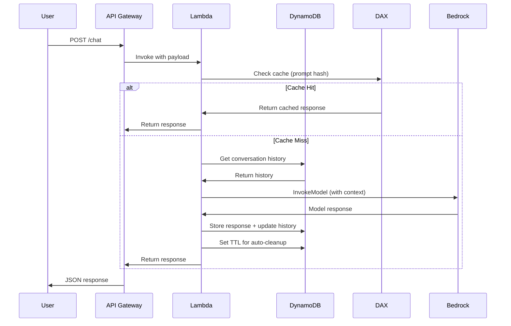

## 🎯 High-Yield Exam Topics from Beta Exam Takers

Critical topics identified by teammates who recently passed the AWS Certified Generative AI Developer – Professional (AIP-C01) beta exam.

---

## 📚 Topic 1: Knowledge Bases - Search & Retrieval Strategies

### 🔍 Search Types

#### 1️⃣ Semantic Search

**What it is:**  
Uses vector embeddings to find results based on **meaning and context** rather than exact keyword matches. Returns results ranked by semantic similarity.

**How it works:**
- Query → Converted to embedding vector → Compared against stored document embeddings → Returns most similar matches

**When to use:**
- ✅ Need conceptually similar results, not exact matches
- ✅ Users query with natural language questions
- ✅ Synonyms and related concepts should be found
- ✅ Context and intent matter more than keywords

**When NOT to use:**
- ❌ Need exact keyword or phrase matching
- ❌ Searching for specific IDs, codes, or identifiers
- ❌ Boolean logic required (AND/OR/NOT operations)

🧠 **Exam cue:**  
"Find documents with similar meaning" → **Semantic Search**  
"Natural language question answering" → **Semantic Search**

---

#### 2️⃣ Hybrid Search

**What it is:**  
Combines **semantic search** (vector-based) with **keyword search** (lexical/BM25) to get best of both worlds. Results are merged and re-ranked.

**How it works:**
- Semantic search finds conceptually similar results
- Keyword search finds exact/partial text matches
- Both result sets are combined and re-ranked using a weighting algorithm

**When to use:**
- ✅ Need both exact matches AND conceptually similar results
- ✅ Queries contain specific terms that must appear (product names, codes)
- ✅ Want to balance precision (exact match) with recall (semantic similarity)
- ✅ Domain-specific terminology mixed with natural language

**When NOT to use:**
- ❌ Pure semantic understanding is sufficient
- ❌ No specific keywords or identifiers in queries
- ❌ Want simplest possible search (semantic-only is simpler)

🧠 **Exam cue:**  
"Need both exact term matching AND conceptual similarity" → **Hybrid Search**  
"Product codes plus natural language description" → **Hybrid Search**

---

### 📦 Chunking Strategies

#### 1️⃣ Fixed-Size Chunking

**What it is:**  
Splits documents into **equal-sized chunks** by character/token count with optional overlap between chunks.

**Parameters:**
- `max_tokens`: Maximum tokens per chunk (e.g., 512, 1024)
- `overlap_percentage`: Overlap between chunks (e.g., 20%)

**When to use:**
- ✅ Documents have consistent structure
- ✅ Simple, predictable chunking needed
- ✅ No clear semantic boundaries in text
- ✅ Want consistent embedding sizes

**When NOT to use:**
- ❌ Documents have clear logical sections (chapters, paragraphs)
- ❌ Breaking semantic units would lose meaning
- ❌ Different document types with varying structures

🧠 **Exam cue:**  
"Uniform chunk sizes across documents" → **Fixed-Size Chunking**  
"Simple chunking strategy" → **Fixed-Size Chunking**

---

#### 2️⃣ Semantic Chunking

**What it is:**  
Splits documents based on **semantic meaning and context**, preserving logical boundaries like paragraphs, sections, or topic shifts.

**How it works:**
- Analyzes document structure and content
- Detects semantic boundaries (topic changes, section breaks)
- Creates chunks that preserve meaning

**When to use:**
- ✅ Documents have clear logical structure (sections, chapters)
- ✅ Preserving context within chunks is critical
- ✅ Topic boundaries matter for retrieval quality
- ✅ Variable-length chunks acceptable

**When NOT to use:**
- ❌ Need consistent chunk sizes for processing
- ❌ Documents lack clear structure
- ❌ Simple fixed-size is sufficient

🧠 **Exam cue:**  
"Preserve semantic meaning and context" → **Semantic Chunking**  
"Respect document structure and boundaries" → **Semantic Chunking**

---

#### 3️⃣ Hierarchical Chunking

**What it is:**  
Creates a **parent-child relationship** between chunks. Large parent chunks provide context, smaller child chunks enable precise retrieval.

**Structure:**
- **Parent chunks:** Broader context (e.g., entire section)
- **Child chunks:** Specific details (e.g., paragraphs within section)
- Retrieval returns child, but provides parent context to LLM

**When to use:**
- ✅ Need precise retrieval with broader context
- ✅ Documents have natural hierarchical structure
- ✅ Balance between specificity and context required
- ✅ Complex documents (technical manuals, legal documents)

**When NOT to use:**
- ❌ Simple documents without hierarchy
- ❌ Additional complexity not needed
- ❌ Flat structure is sufficient

🧠 **Exam cue:**  
"Parent-child chunk relationships for context" → **Hierarchical Chunking**  
"Retrieve specific content with broader context" → **Hierarchical Chunking**

---

### 🗂️ Indexing Strategies

#### Hierarchical Indexing

**What it is:**  
Organizes knowledge base with **multiple levels of granularity**. Documents → Sections → Paragraphs, each indexed separately but linked.

**Benefits:**
- Fast retrieval at different levels
- Context preservation across hierarchy
- Efficient re-ranking using parent context

**When to use:**
- ✅ Large, structured document collections
- ✅ Need multi-level context for LLM
- ✅ Balance between precision and context
- ✅ Complex enterprise knowledge bases

🧠 **Exam cue:**  
"Multi-level document organization with context preservation" → **Hierarchical Indexing**

---

## 📊 Decision Matrix: Search & Chunking

| Requirement | Search Type | Chunking Strategy |
|-------------|-------------|-------------------|
| Exact keywords + conceptual match | Hybrid | Semantic |
| Pure meaning-based retrieval | Semantic | Semantic |
| Consistent processing needs | Semantic | Fixed-Size |
| Complex structured documents | Hybrid | Hierarchical |
| Simple uniform documents | Semantic | Fixed-Size |
| Need context with precision | Semantic or Hybrid | Hierarchical |

---

## 🔧 Topic 2: Logging Best Practices

### Model Invocation Logging

**Best Practice:** Enable **CloudWatch Logs** for Bedrock model invocations

**What to log:**
- ✅ Model ID and version
- ✅ Input prompt (if not sensitive)
- ✅ Model response
- ✅ Inference parameters (temperature, top_p, max_tokens)
- ✅ Token usage (input/output tokens)
- ✅ Latency metrics
- ✅ User/session identifiers
- ✅ Timestamp

**Why:**
- Debug model behavior
- Track costs (token usage)
- Audit trail for compliance
- Performance monitoring

🧠 **Exam cue:**  
"Track model usage and costs" → **CloudWatch Logs with token metrics**  
"Debug unexpected model outputs" → **CloudWatch invocation logs**

---

### Prompt Versioning Logging

**Best Practice:** Use **Bedrock Prompt Management** with **CloudTrail + CloudWatch**

**What to log:**
- ✅ Prompt template ID and version
- ✅ Who approved/deployed prompt
- ✅ When prompt was used
- ✅ Parameters passed to prompt
- ✅ Prompt evaluation metrics

**Why:**
- Track which prompt version caused issues
- Audit trail for compliance
- Rollback capability
- A/B testing analysis

🧠 **Exam cue:**  
"Audit which prompt version was used when" → **CloudTrail + Prompt Management**

---

### Knowledge Base Logging

**Best Practice:** Enable logging at **multiple levels**

1. **S3 Server Access Logs:** Track source document access
2. **OpenSearch Logs:** Vector search queries and results
3. **Bedrock KB API Logs:** RetrieveAndGenerate calls
4. **CloudWatch:** End-to-end RAG pipeline metrics

🧠 **Exam cue:**  
"Complete RAG pipeline observability" → **Multi-layer logging (S3 + OpenSearch + CloudWatch)**

---

---

## 🏗️ Topic 3: Common Architecture Pattern - API Gateway → Lambda → Bedrock

### The Pattern

```
User/App → API Gateway → Lambda → Bedrock → Foundation Model
                              ↓
                          DynamoDB (TTL enabled)
                              ↓
                          DAX (optional)
```

### Components Breakdown

#### API Gateway
**Role:** HTTP/REST API endpoint for client requests

**When to use:**
- ✅ Need REST API with authentication (IAM, Cognito, API Keys)
- ✅ Rate limiting and throttling required
- ✅ Request/response transformation needed
- ✅ CORS support for web clients

🧠 **Exam cue:**  
"Expose Bedrock via REST API with throttling" → **API Gateway**

---

#### Lambda Function
**Role:** Orchestration layer between API Gateway and Bedrock

**Responsibilities:**
- Request validation and preprocessing
- Call Bedrock InvokeModel API
- Response post-processing
- Session management with DynamoDB
- Error handling and retries

**When to use:**
- ✅ Need custom business logic before/after model invocation
- ✅ Multiple service orchestration (Bedrock + DynamoDB + others)
- ✅ Serverless, event-driven architecture
- ✅ Pay-per-request pricing model

🧠 **Exam cue:**  
"Serverless orchestration with custom logic" → **Lambda**

---

#### DynamoDB with TTL

**Role:** Session state, conversation history, caching

**Use Cases:**

**1. Conversation History Storage**
```
{
  "session_id": "abc123",
  "user_id": "user456",
  "messages": [...],
  "ttl": 1704067200  // Auto-delete after 24 hours
}
```

**2. Response Caching**
```
{
  "prompt_hash": "xyz789",
  "response": "...",
  "ttl": 1704063600  // Cache for 1 hour
}
```

**Why TTL:**
- ✅ Automatic cleanup of old sessions
- ✅ Cost optimization (no manual cleanup needed)
- ✅ Compliance (auto-delete PII after retention period)
- ✅ No extra cost for TTL feature

**When to use DynamoDB:**
- ✅ Need fast (single-digit ms) key-value lookups
- ✅ Session/conversation state management
- ✅ Caching with automatic expiration
- ✅ Serverless, scalable NoSQL needed

🧠 **Exam cue:**  
"Store conversation history with automatic cleanup" → **DynamoDB with TTL**  
"Cache responses with expiration" → **DynamoDB TTL**

---

#### DAX (DynamoDB Accelerator)

**Role:** In-memory cache for DynamoDB

**When to use:**
- ✅ Need microsecond latency (DynamoDB gives single-digit milliseconds)
- ✅ Read-heavy workload with hot keys
- ✅ Same data accessed repeatedly
- ✅ Can afford additional cost

**When NOT to use:**
- ❌ DynamoDB performance is already sufficient
- ❌ Write-heavy workload
- ❌ Data constantly changes (cache ineffective)
- ❌ Cost-sensitive application

🧠 **Exam cue:**  
"Microsecond latency for session lookups" → **DAX**  
"Frequently accessed conversation data" → **DAX**  
"DynamoDB performance insufficient" → **Consider DAX**

---

### Complete Flow Example



---

## 🔄 Topic 4: Resilience Patterns for GenAI Applications

### Pattern 1: Step Functions for Complex Workflows

**When to use Step Functions:**
- ✅ Multi-step agentic workflows with decisions
- ✅ Need built-in retry and error handling
- ✅ Long-running processes (up to 1 year)
- ✅ Human-in-the-loop approvals
- ✅ Orchestrating multiple Bedrock/AWS service calls

**Key Features:**

#### Error Handling
```json
{
  "Retry": [
    {
      "ErrorEquals": ["States.Timeout", "ThrottlingException"],
      "IntervalSeconds": 2,
      "MaxAttempts": 3,
      "BackoffRate": 2.0
    }
  ],
  "Catch": [
    {
      "ErrorEquals": ["States.ALL"],
      "Next": "HandleError"
    }
  ]
}
```

**Exam Scenarios:**

| Scenario | Why Step Functions |
|----------|-------------------|
| Multi-agent workflow with fallbacks | Built-in error handling + branching |
| Long document processing pipeline | Handles long execution times |
| Human approval before final output | Wait states + callbacks |
| Parallel processing of multiple requests | Parallel state execution |

🧠 **Exam cue:**  
"Multi-step agent workflow with error handling" → **Step Functions**  
"Orchestrate multiple Bedrock calls with retry logic" → **Step Functions**  
"Human-in-the-loop approval" → **Step Functions with wait state**

---

### Pattern 2: SQS for Asynchronous Processing

**When to use SQS:**
- ✅ Decouple request submission from processing
- ✅ Handle traffic bursts (queue buffers requests)
- ✅ Batch processing of GenAI requests
- ✅ Need guaranteed delivery

**Architecture:**
```
Client → API Gateway → SQS → Lambda → Bedrock
                                ↓
                          DynamoDB (results)
```

**Why this works:**
- Queue absorbs traffic spikes
- Lambda polls queue at controlled rate
- Failed messages automatically retry
- Dead Letter Queue for failures

🧠 **Exam cue:**  
"Buffer GenAI requests during traffic spikes" → **SQS**  
"Decouple request submission from processing" → **SQS**  
"Guaranteed message delivery" → **SQS with DLQ**

---

### Pattern 3: EventBridge for Event-Driven Architecture

**When to use EventBridge:**
- ✅ React to events from multiple sources
- ✅ Route events to multiple targets
- ✅ Schedule periodic GenAI tasks
- ✅ Loosely coupled microservices

**Example Use Cases:**

**1. Document Upload Triggers Processing**
```
S3 (new doc) → EventBridge → Lambda → Bedrock Data Automation
```

**2. Scheduled Batch Summarization**
```
EventBridge (cron) → Step Functions → Bedrock (batch)
```

**3. Multi-Target Event Fanout**
```
Bedrock Response → EventBridge → [Lambda, SQS, SNS]
```

🧠 **Exam cue:**  
"React to S3 document uploads for processing" → **EventBridge + S3**  
"Route single event to multiple processors" → **EventBridge**  
"Schedule periodic AI tasks" → **EventBridge cron rules**

---

### Resilience Decision Matrix

| Requirement | Solution |
|-------------|----------|
| Multi-step workflow with branching | Step Functions |
| Buffer traffic spikes | SQS |
| Event routing to multiple targets | EventBridge |
| Built-in retry with exponential backoff | Step Functions |
| Guaranteed message delivery | SQS |
| Schedule periodic tasks | EventBridge |
| Human approval in workflow | Step Functions wait state |
| Decouple services | SQS or EventBridge |

---

## 🔧 Topic 5: Data Transformation Services - When to Use What

### Service Comparison

#### AWS Glue

**What it is:** Serverless ETL service for data preparation at scale

**When to use:**
- ✅ Large-scale batch data transformation (TB/PB scale)
- ✅ Need data catalog for governance
- ✅ Scheduled ETL jobs
- ✅ Transform data before loading to Knowledge Base
- ✅ Join data from multiple sources

**When NOT to use:**
- ❌ Real-time/streaming data
- ❌ Small datasets (use Lambda instead)
- ❌ Visual, low-code interface needed

🧠 **Exam cue:**  
"Batch transform TB of documents for Knowledge Base ingestion" → **AWS Glue**  
"Schedule nightly ETL for document preprocessing" → **Glue job**

---

#### SageMaker Data Wrangler

**What it is:** Visual, low-code data preparation tool

**When to use:**
- ✅ Need visual interface for data exploration
- ✅ Quick data quality analysis
- ✅ Feature engineering for training data
- ✅ Generate transformation code for production

**When NOT to use:**
- ❌ Production-scale ETL (use Glue)
- ❌ Fully automated pipelines
- ❌ Just need simple transformations

🧠 **Exam cue:**  
"Visual data exploration before model training" → **Data Wrangler**  
"Quick data quality analysis" → **Data Wrangler**

---

#### Lambda

**What it is:** Serverless compute for event-driven processing

**When to use:**
- ✅ Small-scale, real-time transformations
- ✅ Event-triggered processing (S3 upload)
- ✅ Simple preprocessing before Bedrock
- ✅ < 15 min processing time

**When NOT to use:**
- ❌ Large datasets (>10 GB)
- ❌ Long processing time (>15 min)
- ❌ Complex ETL workflows

🧠 **Exam cue:**  
"Transform documents as they're uploaded to S3" → **Lambda S3 trigger**  
"Lightweight preprocessing before Bedrock" → **Lambda**

---

#### Amazon EMR

**What it is:** Managed Hadoop/Spark for big data processing

**When to use:**
- ✅ Massive datasets (PB scale)
- ✅ Complex transformations requiring Spark
- ✅ Need fine-grained cluster control
- ✅ Custom Spark/Hadoop jobs

**When NOT to use:**
- ❌ Simple ETL (use Glue)
- ❌ Don't want to manage clusters
- ❌ Small datasets

🧠 **Exam cue:**  
"Process PB-scale data with custom Spark jobs" → **EMR**

---

### Data Transformation Decision Tree

```
Is data > 10 GB?
├─ NO → Lambda (if event-driven) or Data Wrangler (if visual needed)
└─ YES
    ├─ Need visual exploration? → Data Wrangler
    ├─ Standard ETL at scale? → AWS Glue
    └─ Custom Spark at PB scale? → EMR
```

---

## 📝 **Complete Reference Links:**

### Bedrock & Knowledge Bases
- [Amazon Bedrock Knowledge Bases](https://docs.aws.amazon.com/bedrock/latest/userguide/knowledge-base.html)
- [Amazon Bedrock Model Invocation Logging](https://docs.aws.amazon.com/bedrock/latest/userguide/model-invocation-logging.html)
- [Amazon Bedrock Agents](https://docs.aws.amazon.com/bedrock/latest/userguide/agents.html)

### Integration Services
- [AWS Lambda](https://docs.aws.amazon.com/lambda/latest/dg/welcome.html)
- [Amazon API Gateway](https://docs.aws.amazon.com/apigateway/latest/developerguide/)
- [Amazon DynamoDB](https://docs.aws.amazon.com/amazondynamodb/latest/developerguide/)
- [DynamoDB TTL](https://docs.aws.amazon.com/amazondynamodb/latest/developerguide/TTL.html)
- [Amazon DAX](https://docs.aws.amazon.com/amazondynamodb/latest/developerguide/DAX.html)

### Orchestration & Resilience
- [AWS Step Functions](https://docs.aws.amazon.com/step-functions/latest/dg/welcome.html)
- [Amazon SQS](https://docs.aws.amazon.com/AWSSimpleQueueService/latest/SQSDeveloperGuide/)
- [Amazon EventBridge](https://docs.aws.amazon.com/eventbridge/latest/userguide/)

### Data Transformation
- [AWS Glue](https://docs.aws.amazon.com/glue/latest/dg/what-is-glue.html)
- [SageMaker Data Wrangler](https://docs.aws.amazon.com/sagemaker/latest/dg/data-wrangler.html)
- [Amazon EMR](https://docs.aws.amazon.com/emr/latest/ManagementGuide/)

### Monitoring
- [AWS CloudWatch](https://docs.aws.amazon.com/AmazonCloudWatch/latest/monitoring/)
- [AWS CloudTrail](https://docs.aws.amazon.com/awscloudtrail/latest/userguide/)

---

## ✅ Coverage Complete

All critical topics from your teammates' notes are now covered:
- ✅ Search Types (Semantic, Hybrid)
- ✅ Chunking Strategies (Semantic, Fixed, Hierarchical)
- ✅ Indexing Strategies (Hierarchical)
- ✅ Logging best practices (models, prompts, KBs, S3)
- ✅ API Gateway → Lambda → Bedrock + DynamoDB (TTL) + DAX
- ✅ Resilience patterns (Step Functions, SQS, EventBridge)
- ✅ Data transformation service comparison
